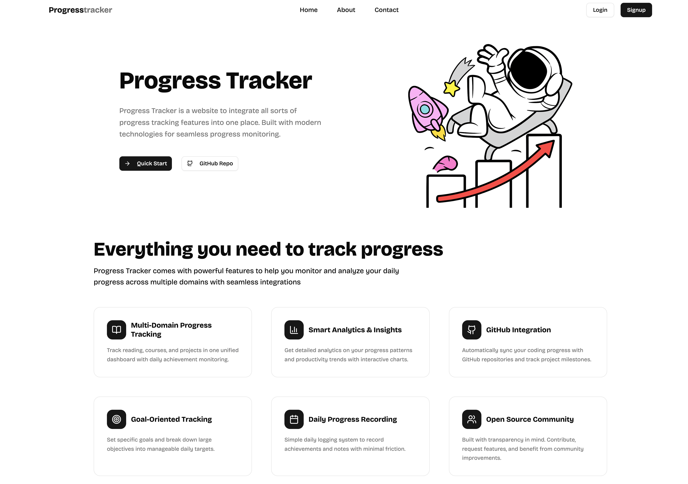
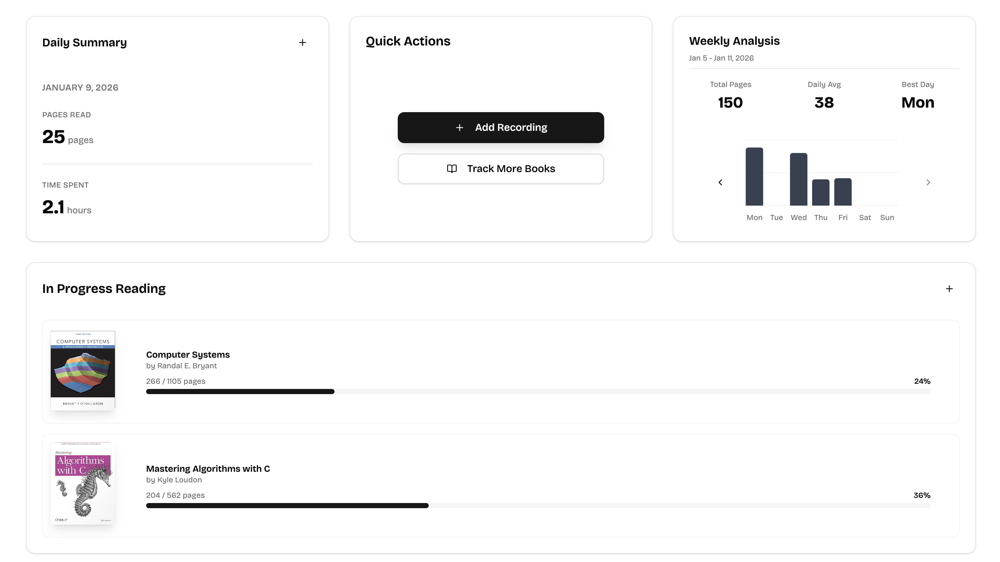
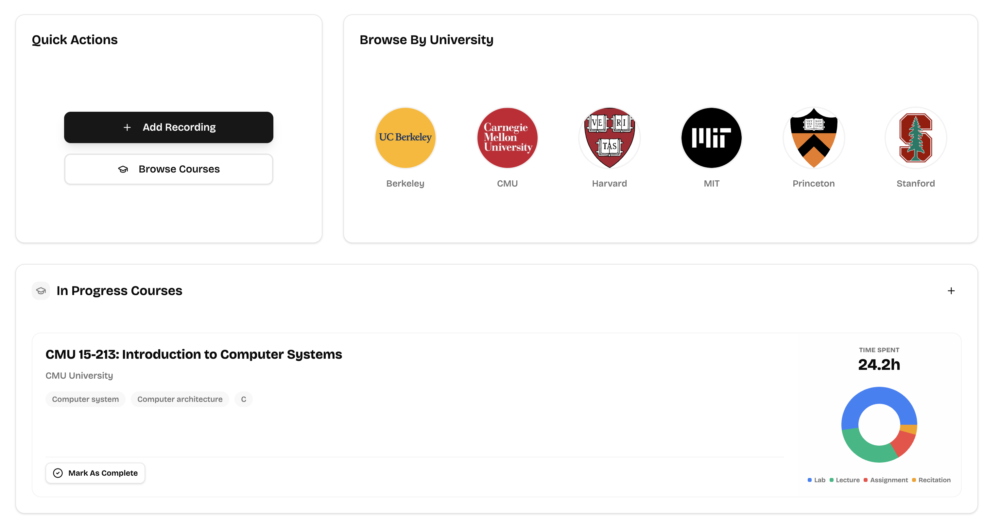
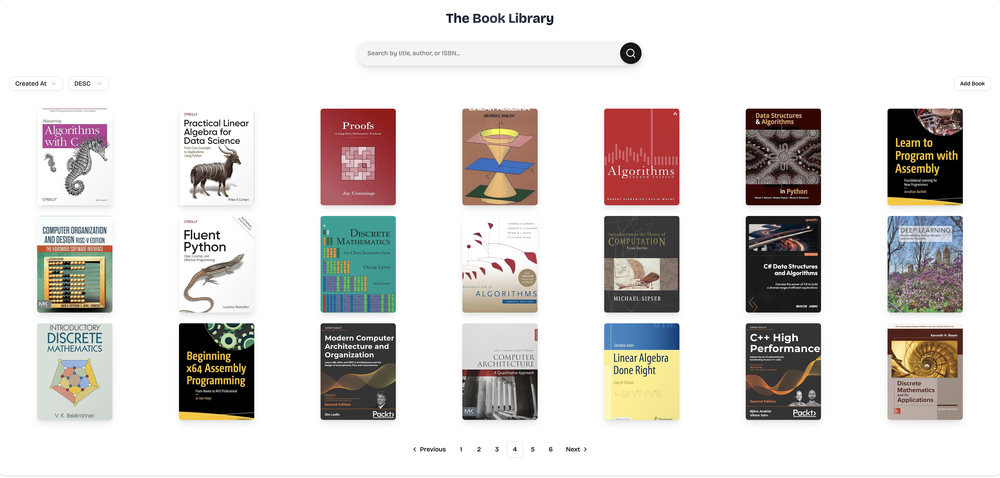
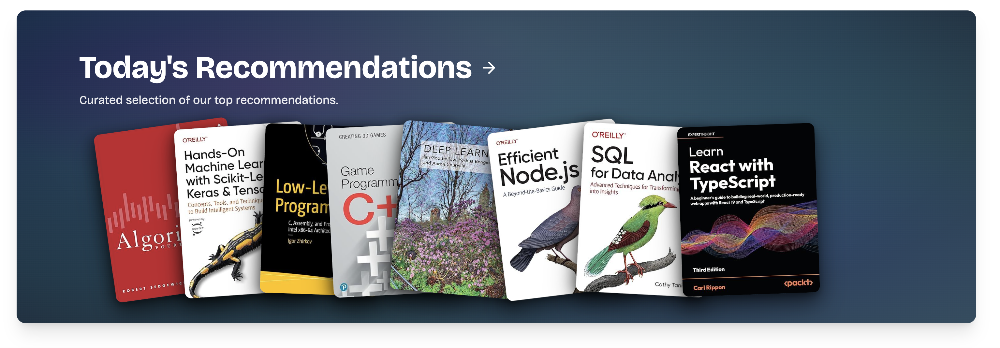

<div align="center">
  

  <h3 align="center">A Modern, Highly-Customizable Progress Tracking Platform</h3>
  <p align="center">Track your reading and course progress with powerful analytics and insights</p>

  <p align="center">
    
    
    
    
    
  </p>
</div>

---

## Overview

**Progress Tracker** is a full-stack application designed to help you monitor and analyze your learning journey. Whether you're tracking books you've read or courses you're taking, the platform provides comprehensive tools for recording progress, visualizing statistics, and maintaining your learning momentum.

Built with a focus on **minimalism** and **modern design principles**, the application offers a clean, intuitive interface that makes progress tracking effortless and enjoyable.

---

## Product Showcase

### Landing Page

<div align="center">
  
</div>

A welcoming landing page that introduces the platform's core features and value proposition. Clean design with clear call-to-actions and feature highlights.

### Reading Progress Tracking

<div align="center">
  
</div>

Comprehensive reading tracking with detailed progress visualization. Record pages read, time spent, and personal notes. View statistics through interactive charts and analytics.

### Course Progress Management

<div align="center">
  
</div>

Track your course progress with multiple record types (lectures, labs, assignments, etc.). Monitor time spent across different activities and visualize your learning patterns.

### Book Library

<div align="center">
  
</div>

Browse and manage your personal book collection. Search through your library, add new books, and track reading progress with detailed metadata and cover images.

### Recommendation System

<div align="center">
  
</div>

Discover new books and courses through intelligent recommendations. Personalized suggestions based on your reading history and preferences.

---

## Key Features

-   **Reading Tracking**: Record pages, time, and notes for each reading session
-   **Course Tracking**: Track multiple course types (lectures, labs, assignments, etc.)
-   **Analytics & Insights**: Visualize your progress with interactive charts and statistics
-   **Search & Filter**: Powerful search capabilities across books and courses
-   **Customizable**: Highly customizable tracking fields and record types
-   **Dark Mode**: Full dark/light theme support
-   **Responsive**: Optimized for desktop, tablet, and mobile devices
-   **Fast & Performant**: Optimized with caching and code splitting

---

## Getting Started

### Quick Start

```bash
# Clone the repository
git clone <repository-url>

# Navigate to project directory
cd progress-tracker-client

# Install dependencies
npm install

# Start development server
npm run dev

# Build for production
npm run build

# Preview production build
npm run preview
```

### Project Structure

The codebase follows **Feature-Sliced Design** principles for optimal organization:

-   **`pages/`**: Minimal router-level components that compose features
-   **`layouts/`**: Structural layout components for routing
-   **`features/`**: Self-contained feature modules with components, hooks, API logic, and constants
-   **`entities/`**: Reusable business entities shared across features (hooks, models, validation)
-   **`lib/`**: Shared utilities, API clients, and configurations
-   **`components/`**: Shared UI components used across features

---

## Design Architecture

The project follows **Feature-Sliced Design (FSD)** architecture, ensuring clean separation of concerns and maintainability

### Tech Stack

Built with modern web technologies and best practices:

| Category               | Technology                                       |
| ---------------------- | ------------------------------------------------ |
| **Frontend Framework** | React 19 with TypeScript                         |
| **Build Tool**         | Vite 7 for fast development and optimized builds |
| **UI Library**         | shadcn/ui built on Radix UI primitives           |
| **Styling**            | Tailwind CSS 4 with custom design system         |
| **State Management**   | TanStack Query v5                                |
| **Routing**            | React Router v7                                  |
| **Charts**             | Recharts for data visualization                  |
| **Validation**         | Zod for type-safe schema validation              |
| **Icons**              | Lucide React                                     |
| **Notifications**      | Sonner toast notifications                       |
| **Theme**              | next-themes for dark/light mode support          |

### Key Design Decisions

**1. Modular Hook Based Architecture**

-   Custom hooks encapsulate data fetching and business logic
-   Reusable hooks promote code consistency across features
-   Clear separation between UI components and data layer

**2. TanStack Query with Cache Key Factory**

-   Centralized cache key management
-   Intelligent cache invalidation strategies
-   Optimistic updates for better UX
-   Automatic request deduplication and background refetching

**3. Type-Safe Development**

-   Full TypeScript coverage with strict mode
-   Zod schemas for runtime validation
-   Generated API types from OpenAPI/Swagger specifications
-   Type-safe component props and hooks

**4. Performance Optimization**

-   Code splitting at route level
-   Lazy loading for heavy components
-   Optimized bundle size with tree-shaking
-   Efficient re-renders with React Query caching

**5. Minimal & Modern UI Design**

-   Clean, uncluttered interfaces
-   Consistent design language across all features
-   Responsive layouts for all screen sizes
-   Accessible components built on Radix UI primitives

---

## Copyright

Copyright © 2025 Yixiang Qiu. All rights reserved.
